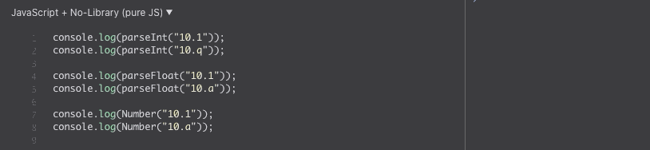

\
<small>JavaScript Logo by tutorialrepublic.com</small>

# The 12 Concepts about JavaScript

JavaScript is one of the most popular languages globally, and it is most commonly used as the language that handles and renders dynamic features to the web pages on a web browser. In was created by Netscape in 1995 and standardized in 1997. Nowadays, JavaScript is the standard language for web applications and is supported by web-browsers such as Firefox, Safari, Chrome, and Edge, among others.

_"JavaScript is officially maintained by ECMA (European Computer Manufacturers Association) as ECMAScript. ECMAScript 6 (or ES6) is the latest major version of the ECMAScript standard"_ `[1]`

# Table of Contents

- [The 12 Concepts about JavaScript](#the-12-concepts-about-javascript)
- [Table of Contents](#table-of-contents)
  - [Variables](#variables)
    - [var, let, and const](#var-let-and-const)
    - [typeof](#typeof)
    - [Null and Undefined](#null-and-undefined)
  - [Strings](#strings)
  - [Numbers](#numbers)
  - [Arrays](#arrays)
  - [Objects](#objects)
  - [Functions](#functions)
  - [Operators](#operators)
  - [Statement](#statement)
    - [If Else Statement](#if-else-statement)
    - [Switch statement](#switch-statement)
  - [Loops](#loops)
    - [For](#for)
    - [For In](#for-in)
    - [While](#while)
    - [Do While](#do-while)
  - [Global Objects](#global-objects)
  - [DOM](#dom)
  - [BOM](#bom)
- [References](#references)
- [Tools](#tools)
- [Author](#author)

JavaScript is easy to use and learn as a programming language. It can be used as scripting language or object-oriented to handle the client-side of the web browser, and more recent as the server-side with Node.js. This document will explain the basic concept associated with JavaScript.

_*For our examples, we will use the `console.log(varName)` that is a function that write message to log on the debug console in the browser. Moreover, in many examples we will write to the console.log using template strings iteration `${}`*_

```JS
 var myVar = 1;
 console.log(`myVar value is ${myVar}`);

```

## Variables

In all languages, variables are entities that are created to hold or store data values. These values can be anything such as string, numbers, objects, functions, arrays, or booleans. In other languages, when a variable is created, the type needs to be defined. However, in JavaScript, the type of the variable is not defined when the variable is created. Therefore, a variable can be created as a string and later become or re-assign to a number or other type.

- Rules for Variables names;
  - names can starts with letters or `$` and `_`
  - names are case sensitive i.e: x and X are not the same variable
  - there are reserved words that cannot be names such as JavaScript or keywords.

### var, let, and const

There are several ways declare a varibale

- using var keyword

```JS
 var name;
```

- assign the value after the variable is created

```JS
  name = 'Francia';
```

- declare the variable with the value

```JS
 var name = 'Francia';
```

- declare several variables at the same time

```JS
 var name = 'Francia', lastname='Riesco', country = 'USA';
```

- The latest version of JavaScript introduced `let` and `const` as a keyword to create or declare variables. Declaring a variable using `let` the variable will be defined on a specific scope, and it can be overwritten or re-assigned. On the contrary, declaring a variable using `const,` the variable is read-only and cannot be modified.

```JS
 let name = 'Francia';
 const country = 'USA';
```

Example:\
 \
<small>An error will appears when you try to re-assign a const variable</small>

### typeof

- in JavaScript we can identity the type of an variable using `typeof`. Moreover, we can notice that a varible which started as String can become a Number or something else.

```JS
var oneName = 'one';
console.log(oneName);
console.log(typeof oneName);

// re-assiging data to our variable
oneName = 1;
console.log(oneName);
console.log(typeof oneName);
```

Example: \


### Null and Undefined

- In javascript, when a variable is `null` is the absence of any value in the variable or object. Moreover, it is treated as false of boolean operations. In the same way, a variable is `undefined` when it has been declared, but not defined. Similar to `null`, `undefined` is treated as false for boolean operations.

```JS
var example = null;
console.log(example);
console.log(Boolean(example));

var example2;
console.log(example2);
console.log(Boolean(example2))
```

Example: \


- While `null` and `undefined` are not the same and they are not interchangable, they share similarities. For instance, When they are compared with double equality (`==`), JavaScript return `true` because double equals(`==`) compares values after convert the variables to the common type. (we will back to `==` and `===`)

```JS
console.log(typeof null);
console.log(typeof undefined);
console.log(null === undefined);
console.log(null == undefined);
console.log(null === null);
console.log(null == null);
console.log(!null);
console.log(isNaN(1 + null));
console.log(isNaN(1 + undefined));
```

Example: \


## Strings

- Variables that are storing text are named string. A String variable has several methods associated that help to manipulate the text. Moreover, a String variable can be declared with single `'` or double `"` quote.

```JS
var oneName = 'one';
var twoName = "two";
```

- String can be concatenated using `+` or using a more modern approach of template strings iteration `${}`

```JS
var oneName = "one"
var twoName = "two"
var example1 = oneName + " is before " + twoName;

console.log(example1)
var example2 = `${oneName} is before ${twoName}`;
console.log(example2)
```

Example: \


- The length of the string can be found using `length`

```JS
var oneName = "one", twoName = "two";
var example1 = oneName + " is before " + twoName;
console.log(example1.length);
```

Example: \


- A string variable has several methods associates and the more relevant are:
  - `indexOf()` that return the index position of a specific text, it return `-1` if the text is not found.
  - `includes()` return a true if the text is part of the string, false if it doesnt't
  - `split(separator)` return and array from the string.
  - `slice(start, end)` it will extract a part of the string

```JS
var str = 'francia riesco homework was good'; // =)
console.log(str.indexOf('r'));
console.log(str.indexOf('y'));
console.log(str.includes('r'));
console.log(str.split(' '));
console.log(str.slice(0, 7));
```

Example:


## Numbers

- JavaScript support integers and floating points numbers such as decimal, hexadecimal to name few.

```JS
var x = 100; // integer
var y = 3.14; // decimal
```

- When two or more number are added, JavaScript does it as regular algebra addition but when you try to add a string with a number JavaScript will concatenate them as they are string.

```JS
var x = 100;
var y = 50;
var z = "80";

console.log(x + y);
console.log(x + z);
console.log(x + y + z);
console.log(x + z + y);
```

Example: \


- JavaScript doesn't get confused `-, %, /, *` and it tries to convert strings to numbers in all numeric operations. If one fo the variables is not an number it will return `NaN`

```JS
var x = 100;
var y = 50;
var z = "80";

console.log(x / z);
console.log(x * z);
console.log(x % z);
console.log(x - z);
console.log(x - z - y);
```

Example: \


- There are three ways to convert string to numbers:
  - `Number()` converted the argument to a number, it doesn't convert when there is letter or other character
  - `parseFloat()` Parses the argument and returns a floating number
  - `parseInt()` Parses its argument and returns an integer

```JS
console.log(parseInt("10.1"));
console.log(parseInt("10.q"));

console.log(parseFloat("10.1"));
console.log(parseFloat("10.a"));

console.log(Number("10.1"));
console.log(Number("10.a"));
```

<small>NaN means Not a Number</small>

Example: \


## Arrays

- Arrays variables thay can store multiples values. In JavaScript, an array can store different type of values in the same array.
- Using `new Array()` is highly discoraged

```JS
var strArray = ["Spain", "Brazil", "Argentina", "U.K."];
var newArray = new Array("California", "Illinois", "Iowa");
var numArray = [1, 2, 3, 4];
var mixArray = ["Spain", 6, "U.K", 19];
var emptyArray = [];
```

- We can access Arrays to elements by indexes
  - The length of the array can be found using `length`
  - `array[index] = value` overwrites an element
  - `push()` add an element at the end of the array
  - `pop()` remove the last element of the array
  - `shift()` remove the first element of the array
  - `unshift()` add an element on the beginning of the array
  - `join()` merge the array into an string;
  - `typeof` an Array will return `object` and we need to use `Array.isArray()` to find if we are dealing with an Array

```JS
var strArray = ["Spain", "Brazil", "Argentina", "U.K."];
sr
```

## Objects

## Functions

## Operators

- A function is a block of code that performs a task, it can be reused, and they are practical for not repeating code or creating a compact logic of code that is easy to read and organize.

## Statement

### If Else Statement

### Switch statement

## Loops

### For

### For In

### While

### Do While

## Global Objects

## DOM

## BOM

```JS

```

```JS

```

# References

1. https://www.tutorialrepublic.com/javascript-tutorial/
1. https://www.w3schools.com/jsref/
1. https://codeburst.io/javascript-null-vs-undefined-20f955215a2
1. https://developer.mozilla.org/en-US/docs/Web/JavaScript/Reference/Global_Objects/null

# Tools

- Written with Markdown
- Hosted by Github
- Gif by Giphy Capture
- VSCode as IDE
- Markdown All in One
- Github desktop for Git respository
- jsfiddle.net to host live code
- Grammarly for proofreading

# Author

Francia Riesco \
August 2020
