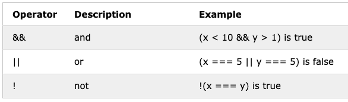

\
<sub>JavaScript Logo by tutorialrepublic.com</sub>

# The 10 Concepts about JavaScript

JavaScript is one of the most popular languages globally, and it is most commonly used as the language that handles and renders dynamic features to the web pages on a web browser. In was created by Netscape in 1995 and standardized in 1997. Nowadays, JavaScript is the standard language for web applications and is supported by web-browsers such as Firefox, Safari, Chrome, and Edge, among others.

_"JavaScript is officially maintained by ECMA (European Computer Manufacturers Association) as ECMAScript. ECMAScript 6 (or ES6) is the latest major version of the ECMAScript standard"_ <sup>1</sup>

**Table of Contents**

- [The 10 Concepts about JavaScript](#the-10-concepts-about-javascript)
  - [Variables](#variables)
    - [var, let, and const](#var-let-and-const)
    - [typeof](#typeof)
    - [Null and Undefined](#null-and-undefined)
  - [Strings](#strings)
  - [Numbers](#numbers)
  - [Arrays](#arrays)
  - [Operators](#operators)
    - [Arithmetic Operators](#arithmetic-operators)
    - [Assignment Operators](#assignment-operators)
    - [String Operators](#string-operators)
    - [Comparison Operators](#comparison-operators)
    - [Conditional (Ternary) Operator](#conditional-ternary-operator)
    - [Logical Operators](#logical-operators)
  - [Objects](#objects)
  - [Functions](#functions)
  - [Statement](#statement)
    - [If Else... Statement](#if-else-statement)
    - [Switch statement](#switch-statement)
  - [Loops](#loops)
    - [For](#for)
    - [While](#while)
  - [Globals](#globals)
    - [Global Properties](#global-properties)
    - [Global Functions](#global-functions)
    - [Global Objects](#global-objects)
      - [MATH](#math)
      - [JSON](#json)
- [Conclusion](#conclusion)
- [References](#references)
- [Tools](#tools)
- [Author](#author)

JavaScript is easy to use and learn as a programming language. It can be used as scripting language or object-oriented to handle the client-side of the web browser, and more recent as the server-side with Node.js. This document will explain the basic concept associated with JavaScript.

_*For our examples, we will use the `console.log(varName)` that is a function that write message to log on the debug console in the browser. Moreover, in many examples we will write to the console.log using template strings iteration `${}`*_

```JS
 var myVar = 1;
 console.log(`myVar value is ${myVar}`);

```

## Variables

In all languages, variables are entities that are created to hold or store data values. These values can be anything such as string, numbers, objects, functions, arrays, or booleans. In other languages, when a variable is created, the type needs to be defined. However, in JavaScript, the type of the variable is not defined when the variable is created. Therefore, a variable can be created as a string and later become or re-assign to a number or other type.

- Rules for Variables names;
  - names can starts with letters or `$` and `_`
  - names are case sensitive i.e: x and X are not the same variable
  - there are reserved words that cannot be names such as JavaScript or keywords.

### var, let, and const

There are several ways declare a varibale

- using var keyword

```JS
 var name;
```

- assign the value after the variable is created

```JS
  name = 'Francia';
```

- declare the variable with the value

```JS
 var name = 'Francia';
```

- declare several variables at the same time

```JS
 var name = 'Francia', lastname='Riesco', country = 'USA';
```

- The latest version of JavaScript introduced `let` and `const` as a keyword to create or declare variables. Declaring a variable using `let` the variable will be defined on a specific scope, and it can be overwritten or re-assigned. On the contrary, declaring a variable using `const,` the variable is read-only and cannot be modified.

```JS
 let name = 'Francia';
 const country = 'USA';
```

Example:\
 \
<sub>An error will appears when you try to re-assign a const variable</sub>

### typeof

- in JavaScript we can identity the type of an variable using `typeof`. Moreover, we can notice that a varible which started as String can become a Number or something else.

```JS
var oneName = 'one';
console.log(oneName);
console.log(typeof oneName);

// re-assiging data to our variable
oneName = 1;
console.log(oneName);
console.log(typeof oneName);
```

Example: \


### Null and Undefined

- In javascript, when a variable is `null` is the absence of any value in the variable or object. Moreover, it is treated as false of boolean operations. In the same way, a variable is `undefined` when it has been declared, but not defined. Similar to `null`, `undefined` is treated as false for boolean operations.

```JS
var example = null;
console.log(example);
console.log(Boolean(example));

var example2;
console.log(example2);
console.log(Boolean(example2))
```

Example: \


- While `null` and `undefined` are not the same and they are not interchangable, they share similarities. For instance, When they are compared with double equality (`==`), JavaScript return `true` because double equals(`==`) compares values after convert the variables to the common type. (we will back to `==` and `===`)

```JS
console.log(typeof null);
console.log(typeof undefined);
console.log(null === undefined);
console.log(null == undefined);
console.log(null === null);
console.log(null == null);
console.log(!null);
console.log(isNaN(1 + null));
console.log(isNaN(1 + undefined));
```

Example: \


## Strings

- Variables that are storing text are named string. A String variable has several methods associated that help to manipulate the text. Moreover, a String variable can be declared with single `'` or double `"` quote.

```JS
var oneName = 'one';
var twoName = "two";
```

- String can be concatenated using `+` or using a more modern approach of Template literals that allows embedded expressions `${}`

```JS
var oneName = "one"
var twoName = "two"
var example1 = oneName + " is before " + twoName;

console.log(example1)
var example2 = `${oneName} is before ${twoName}`;
console.log(example2)
```

Example: \


- The length of the string can be found using `length`

```JS
var oneName = "one", twoName = "two";
var example1 = oneName + " is before " + twoName;
console.log(example1.length);
```

Example: \


- A string variable has several methods associates and the more relevant are:
  - `indexOf()` that return the index position of a specific text, it return `-1` if the text is not found.
  - `includes()` return a true if the text is part of the string, false if it doesnt't
  - `split(separator)` return and array from the string.
  - `slice(start, end)` it will extract a part of the string

```JS
var str = 'francia riesco homework was good'; // =)
console.log(str.indexOf('r')); // return 1
console.log(str.indexOf('y')); // return -1
console.log(str.includes('r')); // return true
console.log(str.split(' ')); // convert string in array
console.log(str.slice(0, 7)); // get a subsctring from 0 to 7
```

Example:


## Numbers

- JavaScript support integers and floating points numbers such as decimal, hexadecimal to name few.

```JS
var x = 100; // integer
var y = 3.14; // decimal
```

- When two or more number are added, JavaScript does it as regular algebra addition but when you try to add a string with a number JavaScript will concatenate them as they are string.

```JS
var x = 100;
var y = 50;
var z = "80";

console.log(x + y); // add x and y
console.log(x + z); // concat x and z, JS convert first x to string
console.log(x + y + z); // concat x, y, z, JS convert x,y to string
console.log(x + z + y); // concat x, y, z, JS convert x,y to string
```

Example: \


- JavaScript doesn't get confused `-, %, /, *` and it tries to convert strings to numbers in all numeric operations. If one fo the variables is not an number it will return `NaN`

```JS
var x = 100;
var y = 50;
var z = "80";

console.log(x / z); // divide x by z, JS convert Z to number
console.log(x * z); // multiply x by z , JS convert Z to number
console.log(x % z); // get the reminder of x by z , JS convert Z to number
console.log(x - z); // rest x by z
console.log(x - z - y); // rest x z and z , JS convert Z to number
```

Example: \


- There are three ways to convert string to numbers:
  - `Number()` converted the argument to a number, it doesn't convert when there is letter or other character
  - `parseFloat()` Parses the argument and returns a floating number
  - `parseInt()` Parses its argument and returns an integer

```JS
console.log(parseInt("10.1")); // parse 10.1 to integer 10
console.log(parseInt("10.q"));// parse 10.q to integer 10

console.log(parseFloat("10.1"));// parse 10.1 to decimal 10.1
console.log(parseFloat("10.a"));// parse 10.a to decimal 10

console.log(Number("10.1")); // convert 10.1 to decimal 10.1
console.log(Number("10.a")); // unable to conver return NaN
```

<sub>NaN means Not a Number</sub>

Example: \


## Arrays

- Arrays variables thay can store multiples values. In JavaScript, an array can store different type of values in the same array.

```JS
var strArray = ["Spain", "Brazil", "Argentina", "U.K."]; // create array with 4 elements
var newArray = new Array("California", "Illinois", "Iowa");// initialize array as new Array and the lements
var numArray = [1, 2, 3, 4]; // array of numbers
var mixArray = ["Spain", 6, "U.K", 19]; // array of string and numbers
var emptyArray = []; // empty array
```

- We can access Arrays to elements by indexes
  - The length of the array can be found using `length`
  - `array[index] = value` overwrites an element
  - `push()` add an element at the end of the array
  - `pop()` remove the last element of the array
  - `shift()` remove the first element of the array
  - `unshift()` add an element on the beginning of the array
  - `join()` merge the array into a string;
  - `typeof` an Array will return `object` and we need to use `Array.isArray()` to find if we are dealing with an Array

```JS
var countries = ["Spain", "Brazil", "Argentina", "U.K."];
console.log("countries length", countries.length);

countries[0] = "Sweden"; // update first elemment with sweden

countries.push("France"); // add new element France at the end of the array
console.log(countries);

countries.pop();// remove the last element (france)
console.log(countries);

countries.unshift("Germany"); // add Germany to the beginning
console.log(countries);

countries.shift();// remove the first element (germany)
console.log(countries);

console.log(countries.join(","));// convert array in string
console.log(typeof countries); // return object
console.log(Array.isArray(countries)); // return true bc it is array
```

Example: \


- looping the array
- there are several ways to loop elements of the array. Moreover, lastest version of JavaScript, introduced simple way to do it

```JS
var countries = ["Spain", "Brazil", "Argentina", "U.K."];
// classic
for (var i = 0; i < countries.length; i++) {
  console.log(countries[i]);
}
console.log('---');
// in
for (var i in countries) {
  console.log(countries[i]);
}
console.log('---');
// of: it doesn't care about the index of the element
for (var country of countries) {
  console.log(country);
}
```

Example: \


## Operators

- In javascript, operators classified as `Arithmetic Operators`, `Assignment Operators`, `String Operators`, `Comparison Operators`, `Conditional (Ternary) Operator`, `Logical Operators`. Operators are the most useful elements in JavaScript helping, the software developer write the logic and functionality of her code.

### Arithmetic Operators

- They are used to perform arithmetic between variables and/or values<sup>5</sup>.

Table: \
\
<sub>courtesy of w3schools.com<sup>5</sup></sup>

```JS
var x = 5;
var y = 2;
console.log("5 + 2:", 5 + 2); // add two numbers
console.log("5 - 2:", 5 - 2); // rest two numbers
console.log("x + y:", x + y); // add two variables
console.log("x - y:", x - y); // rest two variables
console.log("x * y:", x * y); // x multiplied by y
console.log("x ** y:", x ** y); // x power to y
console.log("x / y:", x / y); // x divided by y
console.log("x % y:", x % y); // remainder of div between x and y
console.log("++x:", ++x); // add one to x
console.log("--x:", --x); // remove one to x
```

Example: \


### Assignment Operators

- Assignment operators are used to assign values to JavaScript variables<sup>5</sup>. `=` is one of the most important operators, we use to create variables, re-assign values and many others.

Table: \
\
<sub>courtesy of w3schools.com<sup>5</sup></sup>

```JS
var x = 5;
var y = 2;
console.log(" x += y", (x += y)); // and y to x and update x
console.log("x -= y", (x -= y)); // rest x to y and update x
console.log("x *= y", (x *= y)); // multiply x and y and update x
console.log("x /= y", (x /= y)); // divided x and y and update x
console.log("x %= y", (x %= y)); // get the module x and y and update x
```

Example: \


### String Operators

- In JavaScript, `+` add operator is used to concatenate two or more string.
- New version of JavaScript use template interpolation `${}` rather than `+` (as mentioned in String manipulation as variable).

Table: \
\
<sub>courtesy of w3schools.com<sup>5</sup></sup>

```JS
var oneName = "one";
var twoName = "two";
var example = oneName + " before than " + twoName;
console.log(example);
oneName += " before than " + twoName;
console.log(oneName);
```

Example: \


### Comparison Operators

- they are used in logical statements to determine `equality` or `difference` between values. Moreover, they return boolean `true` or `false` depending the results<sup>5</sup>.

Table: when `x = 5` \
\
<sub>courtesy of w3schools.com<sup>5</sup></sup>

```JS
var x = 5;
console.log("x == 8", x == 8);
console.log("x == 5", x == 5);
console.log('x == "5"', x == "5"); // true equal value
console.log("x === 5", x === 5); // true equal type equal value
console.log('x === "5"', x === "5"); // false no equal type
console.log("x != 8", x != 8);
console.log("x != 5", x != 5);
console.log('x != "5"', x != "5");
console.log("x !== 8", x !== 8);
console.log("x !== 5", x !== 5);
console.log('x !== "5"', x !== "5");
console.log("x > 8", x > 8);
console.log("x < 8", x < 8);
console.log("x > 5", x > 5);
console.log("x < 5", x < 5);
console.log("x >= 8", x >= 8);
console.log("x <= 8", x <= 8);
console.log("x >= 5", x >= 5);
console.log("x <= 5", x <= 5);
```

Example: \


### Conditional (Ternary) Operator

- This operator assigns a value to a variable based on a condition<sup>5</sup>. Moreover, this operator is an easy way to reduce the amount of code and syntax. (see `If Else Statement`)

Table: \
\
<sub>courtesy of w3schools.com<sup>5</sup></sup>

```JS
var isSpanish = true;
// if / else simplified
var name = isSpanish ? "hola" : "hello";
console.log(name);
// if variable exist
var oneName = name ? name : "noname";
console.log(name);
// even shorter version of if variable exist
var twoName = name ?? "noname";
console.log(twoName);
```

Example: \


### Logical Operators

- These are used to determine the logic between variables or values.

Table: when `x = 6`, `y = 3`\
\
<sub>courtesy of w3schools.com<sup>5</sup></sup>

- `&&` both arguments need to be `true` then return `true`, otherwise, return `false`.
- `||` if one of the argument is `true` then return `true`, if both of them are `false` return `false`.
- `!` convert the boolean to the contrary, if argument is `true` return `false` and viceversa.

```JS
var x = 6;
var y = 3;
console.log("x < 10", x < 10); // true
console.log("y > 1", y > 1); // true
console.log("x < 10 && y > 1", x < 10 && y > 1); // true
console.log("x == 5", x == 5); // false
console.log("y > 2", y > 2); // true
console.log("x == 6 || y > 2", x == 6 || y > 2); //first is false, second is true then all true
console.log("!(x == y)", !(x == y)); // the result inside the parentheses is false and !false is true
```

Example: \


## Objects

- Objects are variables that can contain many values and these values are call properties.
- values are written as pair of `name:value` AKA `key:value`.
- `delete` remove property
- An object can have `functions` as `properties`. To access other properties inside a object function, you need to use `this`. and `this` is the object itself.

```JS
var obj = {
  firstName: "Francia",
  lastName: "Riesco",
};
console.log(obj);
```

```JS
var obj = {}; // empty object
// add propertie later
obj["firstName"] = "Francia";
obj.lastName = "Riesco";
obj.age = 30;
console.log(obj);
// remove property
delete obj.firstName;
console.log(obj);
```

```JS
var obj = {
  firstName: "Francia",
  lastName: "Riesco",
   fullName: function () {
    return `${this.firstName}  ${this.lastName}`;
  },
};
console.log(obj.fullName());
```

Example: \


## Functions

- A function is a block of code that performs a task, it can be reused, and they are practical for not repeating code or creating a compact logic of code that is easy to read and organize.
- A `function` is define by using the keyword function, then name of the functions.
- A `function` can have pararemeters or not.
- A `function` can `return` a value or execute and action (`void`).
- A `function` can access global variables.
- A `function` can have local variables that only exist when the function is invoked.

```JS
// function with no params and return
function myFunction() {
  return "hello";
}
console.log(myFunction());
// function with no params and no return
function myFunction2() {
  console.log("hello2");
}
myFunction2();
// function with params and return
function myFunction3(x, y) {
  return x + y;
}
console.log(myFunction3(1, 4));
// function with params and no return
function myFunction4(x, y) {
  console.log("from myFunction: ", x + y);
}

myFunction4(5, 7);
```

Example: \


## Statement

- In JavaScript we can write code that will perform different depending of a logical condition. If the evaluated expression is `true` will perform one action and false another, when you have more than two options, you can use switch stament<sup>10</sup>.

### If Else... Statement

- `if statement` _executes a block of code only if the specified condition is `true`<sup>10</sup>_.
- `if...else statement` _executes one block of code if the specified condition is `true` and another block of code if it is `false`<sup>10</sup>_.
- `if...else if....else statement` _executes a combination multiple stament <sup>10</sup>_.

```JS
// basic if statement
if(condition) {
 // some code
}
// if else statement
if(condition) {
    // Code if condition is true
} else {
    // Code if condition is false
}

// if else if else condition
if(conditionA) {
    // Code if conditionA is true
} else if(conditionB) {
    // Code  if the conditionB is false and conditionB is true
} else {
    // Code if both conditionA and conditionB are false
}
```

```JS
var x = 5;
// basic if statement
if (x == 5) {
  console.log(`x is ${x}`);
}

var y = 10;
// if / else statement
if (y > 8) {
  console.log(`y greater than 8`);
} else {
  console.log(`y less than 8`);
}
// if else if statement
if (x > 8) {
  console.log(`x greater than 8`);
} else if (x == y) {
  console.log(`x equal y`);
} else {
  console.log(`x is less than 8 and diff y`);
}
```

Example: \


- Ternary operator replace if/else statement, this reduce the lines of code and it is easy to maintain

```JS
var age = 30;
var whatSheGets;
if (age >= 21) {
  whatSheGets = "she drinks wine";
} else {
  whatSheGets = "she drinks milk";
}
console.log(whatSheGets);

var age = 18;
var whatSheGets = age >= 21 ? "she drinks wine" : "she drinks milk";
console.log(whatSheGets);
```

Example: \


### Switch statement

- `switch statement` to select one of many code blocks to be executed.
- `break` is used to single out each case block (other blocks are executed);
- `default` is the last expression and it is executes if nothing else matched

```JS
// simple implementation
switch(expression) {
  case x:
    // code block
    break;
  case y:
    // code block
    break;
  default:
    // code block
}
// z and y are grouped and execute same code block
switch(expression) {
  case x:
    // code block
    break;
  case z:
  case y:
    // code block
    break;
  default:
    // code block
}
```

```JS
var browser = "Chrome";
switch (browser) {
  case "Edge":
  case "Safari":
    console.log("What are you doing?");
    break;
  case "Chrome":
  case "Firefox":
    console.log("We support these browsers too");
    break;
  case "Opera":
    console.log("Wut?");
    break;
  default:
    console.log("how can you see this page?");
}
```

Example: \


## Loops

- `Loops` are the way JavaScript has to execute a block of code until a condition is met<sup>13</sup>.
- `Loops` can execute a block of code a number of times. Software developer must ensure the loop finish or her application can run out of memory.

### For

- `for` is one of the most populars loops statement in JavaScript.
- `for` can be used to loop through arrays or any other conditions.
- `statement One` is the initial parameter to start the loop.
- `statement two` declares the condition until the for loop runs.
- `statement Three` executes at the end of each iteration.

```JS
for (statement One; statement two; statement Three) {
  // code block
}
```

```JS
// for run intil i is less than 5
for (var i = 0; i < 5; ++i) {
  console.log(i);
}
var array = [1, 2, 3, 5];
// for run until i is not greater than array length
for (var i = 0; i < array.length; ++i) {
  console.log(array[i]);
}
```

Example: \


### While

- `while` loops through a block of code as long as the condition is `true`<sup>13</sup>.

```JS
while (condition) {
  // code block
  // must have condition break
}
```

```JS
// while run intil i is less than 5
var i = 0;
while (i < 5) {
  console.log(i);
  ++i; // i needs to increments or the condition never met
}
var array = [1, 2, 3, 5];
// while run until i is not greater than array length
i = 0;
while (i < array.length) {
  console.log(array[i]);
  ++i; // i needs to increment or the loop will never end
}

```

Example: \


## Globals

- Global functions, properties and objects that can be used in any place in the code. They are built-in JavaScripts elements.

### Global Properties

- `Infinity` _A numeric value that represents positive/negative infinity_<sup>6</sup>.
- `NaN` Not-a-Number
- `undefined` _Indicates that a variable has not been assigned a value_<sup>6</sup>.

### Global Functions

- Convert variables
  - `Number()` converted the argument to a number, it doesn't convert when there is letter or other character
  - `parseFloat()` Parses the argument and returns a floating number
  - `parseInt()` Parses its argument and returns an integer
  - `String()` convert any value to string

```JS
console.log(parseInt("10.1"));
console.log(parseFloat("10.1"));
console.log(Number("10.1"));
console.log(String(10));
```

Example: \


### Global Objects

#### MATH

- Some Properties
  - `Math.PI` PI (approx. 3.14)
  - `Math.E` Euler's number (approx. 2.718)
  - `Math.LN2` natural logarithm of 2 (approx. 0.693)
  - `Math.LN10` natural logarithm of 10 (approx. 2.302)

```JS
console.log(Math.PI);
console.log(Math.E);
console.log(Math.LN2);
console.log(Math.LN10);
```

Example: \


- Some Methods
  - `Math.round(x)` _returns the value of x rounded to its closest integer<sup>8</sup>_.
  - `Math.pow(x, y)` _returns the value of x to the power of y<sup>8</sup>_.
  - `Math.sqrt(x)` _returns the square root of x<sup>8</sup>_.
  - `Math.floor(x)` _returns the value of x rounded down to its closest integer<sup>8</sup>_.
  - `Math.ceil(x)` _returns rounded upwards to the closest integer<sup>8</sup>_.
  - `Math.max(x, y, z, ..., n)` _returns the number with the highest value<sup>8</sup>_.
  - `Math.min(x, y, z, ..., n)` _returns the number with the lowest value<sup>8</sup>_.
  - `Math.random()` _returns a random number between 0 (inclusive), and 1 (exclusive)<sup>8</sup>_.

```JS
console.log(Math.round(5.6)); // 6
console.log(Math.pow(5, 2)); // 25
console.log(Math.sqrt(25)); // 5

console.log(Math.floor(4.5)); // 4
console.log(Math.floor(4.7)); // 4
console.log(Math.floor(4.3)); // 4

console.log(Math.ceil(4.5)); // 5
console.log(Math.ceil(4.7)); // 5
console.log(Math.ceil(4.3)); // 5

console.log(Math.max(4, 10)); // 10
console.log(Math.min(4, 10)); // 4

console.log(Math.random()); // number between 0 or 0.99999999
```

Example: \


#### JSON

- `JSON` means for (JavaScript Object Notation)<sup>9</sup>
- `JSON` _is a format for storing and transporting data_<sup>9</sup>.
- `JSON` is language independent and its syntax is derived from JavaScript object notation syntax. However,`JSON` format is text only. Read and Write `JSON` data can be written in any programming language<sup>9</sup>.
- `JSON` syntax is identical to a JavaScript objects. Moreover, a JavaScript can easily convert `JSON` data into native JavaScript objects.<sup>9</sup>.
- `JSON.parse(text)` convert a string into JavaScript Object, if the string was storing a JSON dataset.
- `JSON.stringify(obj)` convert a JavaScrpt Object into a JSON string.

```JS
var obj = {
  firstName: "Francia",
  lastName: "Riesco",
  age: 30,
};
// convert JS object to String JSON
var flatObject = JSON.stringify(obj);
console.log(flatObject);
// convert String JSON to JS object
var parsedObject = JSON.parse(flatObject);
console.log(parsedObject);
```

Example: \


# Conclusion

- JavaScript has become one of the most popular programming language nowadays. Its syntax is simple and easy to follow. Moreover, when used for web applications, it is a lightweight, powerful tool to create dynamic sites that are easy to maintain and upgrade.

# References

1. https://www.tutorialrepublic.com/javascript-tutorial/
1. https://www.w3schools.com/jsref/
1. https://codeburst.io/javascript-null-vs-undefined-20f955215a2
1. https://developer.mozilla.org/en-US/docs/Web/JavaScript/Reference/Global_Objects/null
1. https://www.w3schools.com/jsref/jsref_operators.asp
1. https://www.w3schools.com/jsref/jsref_obj_global.asp
1. https://www.w3schools.com/js/js_comparisons.asp
1. https://www.w3schools.com/js/js_math.asp
1. https://www.w3schools.com/js/js_json.asp
1. https://www.tutorialrepublic.com/javascript-tutorial/javascript-if-else-statements.php
1. https://www.w3schools.com/js/js_switch.asp
1. https://www.w3schools.com/js/js_loop_for.asp
1. https://www.w3schools.com/js/js_loop_while.asp

# Tools

- Written with Markdown
- Hosted by Github
- Gif by Giphy Capture
- VSCode as IDE
- Markdown All in One
- Github desktop for Git respository
- jsfiddle.net to host live code
- Grammarly for proofreading

# Author

Francia Riesco \
August 2020
