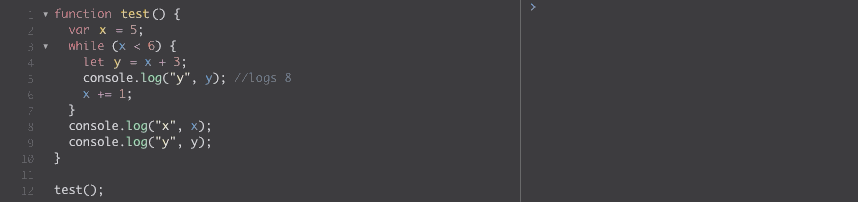
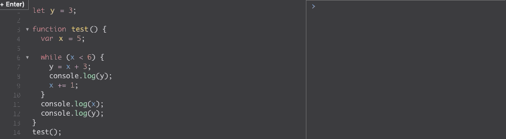
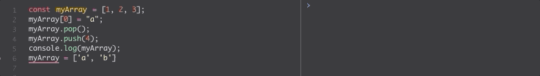
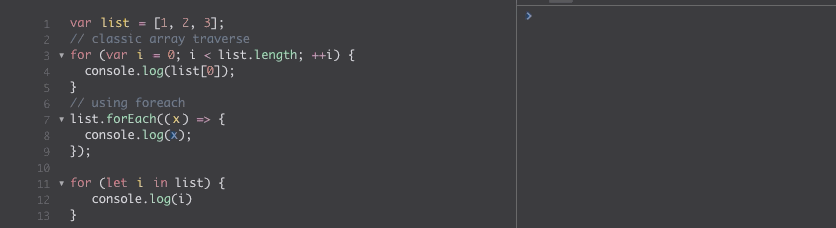
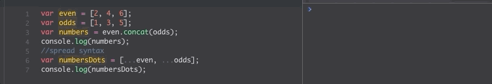
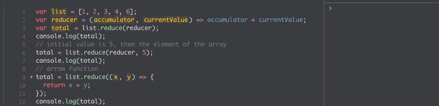
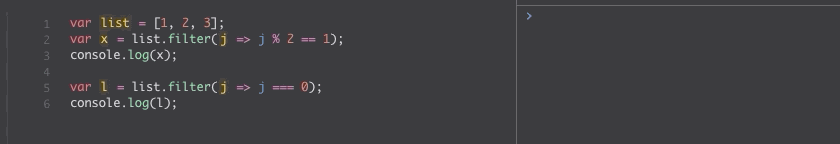
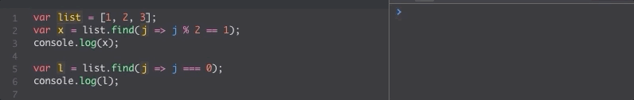

 \
<sub> JavaScript Logo by i.morioh.com</sub>

# JavaScript evolution and Modern Syntaxis

# Table Of Contents

- [JavaScript evolution and Modern Syntaxis](#javascript-evolution-and-modern-syntaxis)
- [Table Of Contents](#table-of-contents)
- [Brief History](#brief-history)
  - [Version list and releases dates](#version-list-and-releases-dates)
  - [Versions Evolution](#versions-evolution)
- [Strict Mode](#strict-mode)
- [Variables](#variables)
  - [let](#let)
  - [const](#const)
- [Functions](#functions)
  - [Functions Evolution](#functions-evolution)
  - [Functions can have default parameters](#functions-can-have-default-parameters)
  - [Immediately invoked function expression (IIFE)](#immediately-invoked-function-expression-iife)
  - [Arrow Functions](#arrow-functions)
- [Arrays](#arrays)
  - [Traverse Arrays](#traverse-arrays)
  - [Array Concat](#array-concat)
  - [Array Reduce](#array-reduce)
  - [Array Filter](#array-filter)
  - [Array Find](#array-find)
- [Objects](#objects)
- [Promises](#promises)
- [Async and Wait](#async-and-wait)
- [Future](#future)
- [References](#references)
- [Tools](#tools)
- [Author](#author)

# Brief History

JavaScript(JS) is a compiled programming language known as the scripting languages for the web. JavaScript is a single-threaded language that supports object-oriented programming. It was initially developed by Netscape and standardized by ECMAScript. This scripting language was initially named Mocha, later LiveScript, and finally, JavaScript. In the beginning, all releases were called by a numeric value. However, after June 2015, ES6(6th version) name convention changed to ECMAScript 2015 (ES2015) to follow annual releases of the standard. The latest version released in June 2020, named ECMAScript 2020 (ES2020) or ES11.

\
_“An organization that creates standards for technologies.” - European Computer Manufacturers Association (ECMA)_

## Version list and releases dates

 \
<sub>courtesy freecodecamp.org</sub>

## Versions Evolution

The first two versions were quickly released in the late 90s. The new browser competition generated that each browser added functionalities beyond ECMAScript standards. These additions brought a substantial technical fragmentation between browser and JavaScript compatibility. With the decline of Netscape, which was leading the development of JavaScript, the ES4 release was abandoned. For the next years, the committee controlling the proposal for ECMAScript Standard was Microsoft, Mozilla, Adobe, and Opera. The committee took years to agree on features and new standards for JavaScript, but in 2009 comes the major release ES5. This version became the most supported version of JavaScript. With the arrival of Google Chrome, the ECMAScript committee agreed to evolve JavaScript beyond the web browsers and make it a general-purpose language. The generalization of JavaScript gives this programming language a new life as one of the most dominant languages nowadays. This allowed JavaScript to be used to web pages, mobile apps, server-side, application, and many more.`[2]`

**Next a list of the most useful features of JavaScript**

# Strict Mode

- `strict mode` was introduced in ES5 as an optional restrictive variant of JavaScript. The objective of `strict mode` is to eliminate sloppy code, JS silent errors. Also, it helps to JS run faster because the JS engine does not have to handle ambiguities in the code.

- `strict mode` is using by adding `'use strict';` at the beginning of the JS document or in a specific line of part of the code.

```JS
// Whole-script strict mode
'use strict';
var v = "mode script!";
```

```JS
function strict() {
  // Function-level strict mode
  'use strict';
  return "strict mode function!  ";;
}
function notStrict() { return "no strict."; }
```

# Variables

The classic way to declare a variable in JavaScript is using the keyword `var`. A variable created with `var` it is assigned to the global object and it is available everywhere in the code. Moreover, a variable declared with `var` inside a function it is local and available only on the function.

## let

- Declaring a variable using `let` allows that this new variable is only bound to a block, this is named `block scoping`. In other words, the variable will be available inside the scope `{ .. }`

```JS
var a = 2;
{
  let a = 3;
  console.log(a); // 3
}
console.log(a); // 2

```

- On the contrary than `var`, declaring `let` outside of any function, the variable is not a global variable but it will be available on all lower scope;

```JS
function test() {
  var x = 5;
  while (x < 6) {
    let y = x + 3;
    console.log("y", y);
    x += 1;
  }
  console.log("x", x);
  console.log("y", y);
}

test();
```

Example: \


```JS
let y = 3;

function test() {
  var x = 5;

  while (x < 6) {
    y = x + 3;
    console.log(y);
    x += 1;
  }
  console.log(x);
  console.log(y);
}
test();

```

Example: \


## const

- `const` declares a constanst variable that cannot be reasigned.
- Similar to `let`, `const` has block scope.
- An array declared as `const`, its elements can be overwritten but not the array itself.

```JS
const myArray = [1, 2, 3];
myArray[0] = "a";
myArray.pop();
myArray.push(4);
console.log(myArray);
myArray = ['a', 'b']
```

Example: \


# Functions

- In javascript, a `function` is a block of code that can be used multiple times, in a different part of the code, and this makes the code reusable and easy to maintain.

```JS
 function myFunction(p1, p2) {
  return p1 * p2;
}
```

## Functions Evolution

- With the new editions of JavaScript, functions become one of the first element evolved to more useful functionalities.

```JS
// Named function declaration (classic)
function myFunction () { /* ... */ }

// function expression assigned to a variable
var myFunction = function () { /* ... */ };

// function as object property
var myObj = {
    myFunction: function () { /* ... */ }
};
```

## Functions can have default parameters

- With default parameters in a function, we don't need extra code to check for a missing parameter in a function

```JS
function myFunction(p1 = 5, p2 = 10) {
  return p1 * p2;
}
```

## Immediately invoked function expression (IIFE)

- this is a design patter known as `self-executing anonymous function` that runs as soon as it is defined.
- The first part `(function () { })` is the anonymous function. This prevents accessing variables within the IIFE, and polluting the global scope.
- The second part `()` creates the immediately invoked function, where JavaScript will inmediatelly interpret the function.

```JS
(function () {
   /*  ... */
})();

// passign parameters to the IIFE
var x = "value";
(function (innerX) {
    console.log(innerX);
})(x);
```

## Arrow Functions

- This type of functions was introduced on ES6 and revolutionized the way of JavaScript looks forever.
- The new syntax to write functions allowed condensed and concise code, where the `function` prefix, `return,` curly brackets `{}` and parentheses become obsolete.

```JS
// classic function
function test() {
  return "test!";
}

// function as variable
let test = function () {
  return "test!";
};

// arrow function
let test = () => {
  return "test!";
};

// arrow function return vlaue by default
let test = () => "test!";

// arrow function with parentheses
let test = (x) => {
 x * 10;
};

// arrow function without parentheses
let test = x => x * 10;
```

# Arrays

- Every new version of JavaScript introduce new features to arrays and arrays manipulation. These are few of them

## Traverse Arrays

```JS
var list = [1, 2, 3];
// classic array traverse
for (var i = 0; i < list.length; ++i) {
  console.log(list[0]);
}
// using foreach
list.forEach((x) => {
  console.log(x);
});

for (let i in list) {
   console.log(i)
}
```

Example: \


## Array Concat

- using `concat()` was the way to merge one or more array. `concat()` was always returning a new array with the merged element
- Now, we can do the same with `spread syntax` or `...`

```JS
var even = [2, 4, 6];
var odds = [1, 3, 5];
var numbers = even.concat(odds);
console.log(numbers);
//spread syntax
var numbersDots = [...even, ...odds];
```

Example: \


## Array Reduce

- `reduce()` executes the function provides and for each element of the array, the result is a single value

```JS
var list = [1, 2, 3, 4, 6];
var reducer = (accumulator, currentValue) => accumulator + currentValue;
var total = list.reduce(reducer);
console.log(total);
// initial value is 5, then the element of the array
total = list.reduce(reducer, 5);
console.log(total);
// arrow function
total = list.reduce((x, y) => {
  x + y;
});
console.log(total);
```

Example: \


## Array Filter

- `filter()` will return all the element that match the argument or an empty array if it doesn't find any match

```JS
var list = [1, 2, 3];
var x = list.filter(j => j % 2 == 1);
console.log(x);

var l = list.filter(j => j === 0);
console.log(l);
```

Example: \


## Array Find

- `find()` will return the first element that match the arguments, or undefined if it doesn't find it

```JS
var list = [1, 2, 3];
var x = list.find(j => j % 2 == 1);
console.log(x);

var l = list.find(j => j === 0);
console.log(l);
```

Example: \


# Objects

# Promises

# Async and Wait

# Future

JavaScript is taking the word with every new release, many more features that improve the experience as a software developer, and the speed and experience of the users on the internet.

# References

1. https://developer.mozilla.org/en-US/docs/Web/JavaScript
1. https://www.freecodecamp.org/news/es5-to-esnext-heres-every-feature-added-to-javascript-since-2015-d0c255e13c6e/
1. https://swarmonline.com/the-evolution-of-javascript/
1. https://medium.com/javascript-in-plain-english/the-relationship-between-javascript-ecmascript-6d17706a576
1. https://medium.com/launch-school/javascript-es6-var-let-const-9645f543f7cb
1. https://developer.mozilla.org/en-US/docs/Glossary/IIFE
1. https://www.w3schools.com/js/js_arrow_function.asp
1. http://adripofjavascript.com/blog/drips/an-introduction-to-iffes-immediately-invoked-function-expressions.html
1. https://www.tutorialspoint.com/es6/es6_arrays.htm
1. https://exploringjs.com/es6/ch_arrays.html
1. https://developer.mozilla.org/en-US/docs/Web/JavaScript/Reference/Strict_mode
1. https://developer.mozilla.org/en-US/docs/Web/JavaScript/Reference/Global_Objects/Array/reduce

# Tools

- Written with Markdown
- Hosted by Github
- Gif by Giphy Capture
- VSCode as IDE
- Github desktop for Git respository
- jsfiddle.net to host live code
- Grammarly for proofreading

# Author

Francia Riesco \
August 2020
